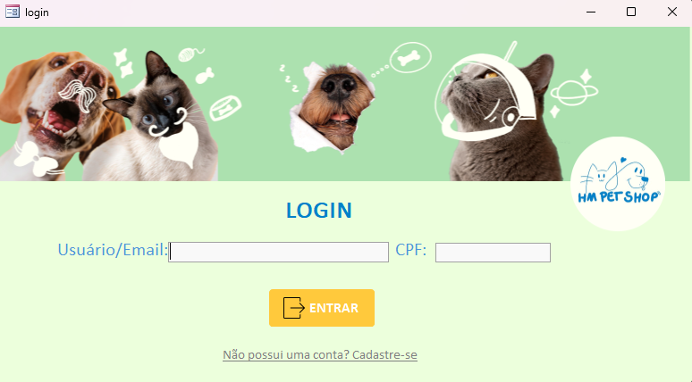
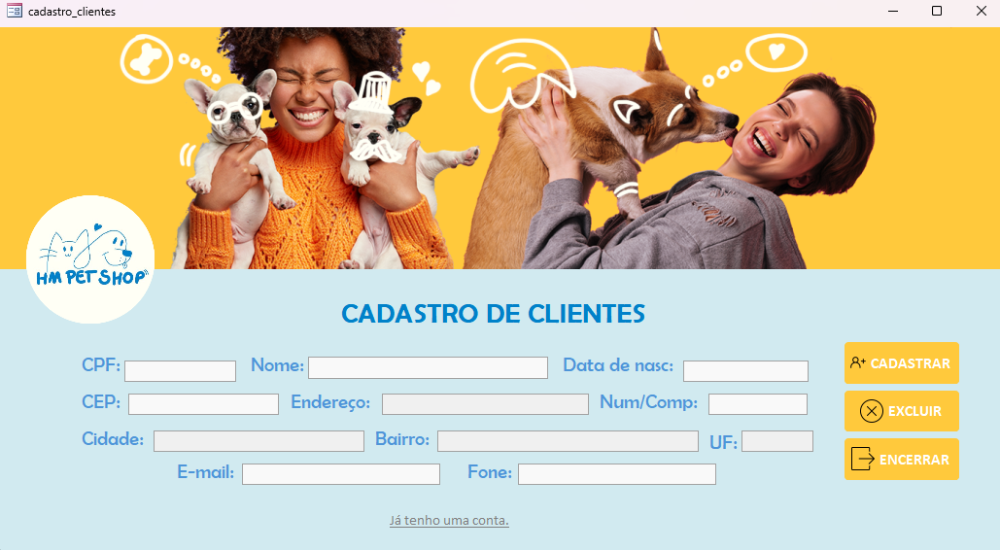
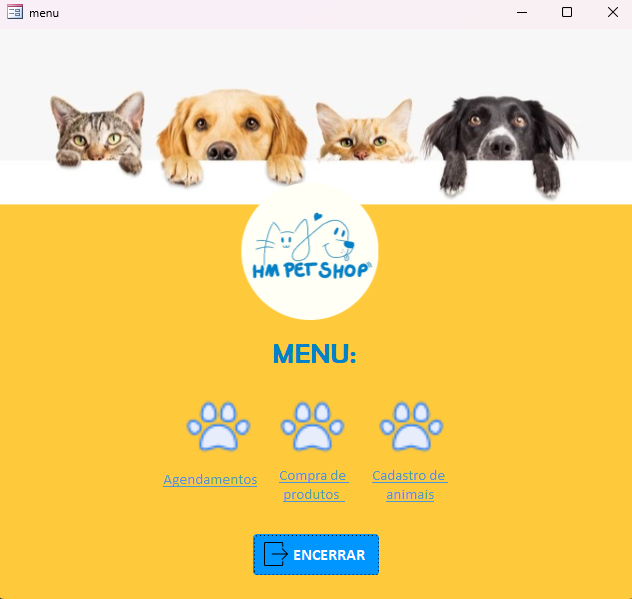
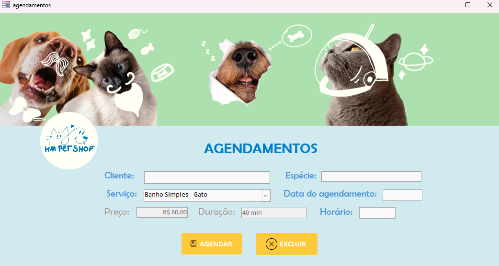
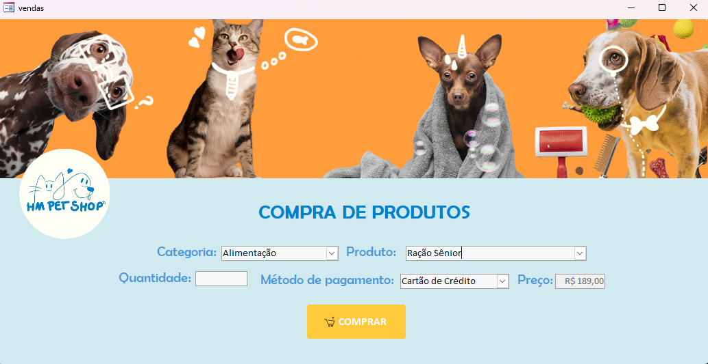
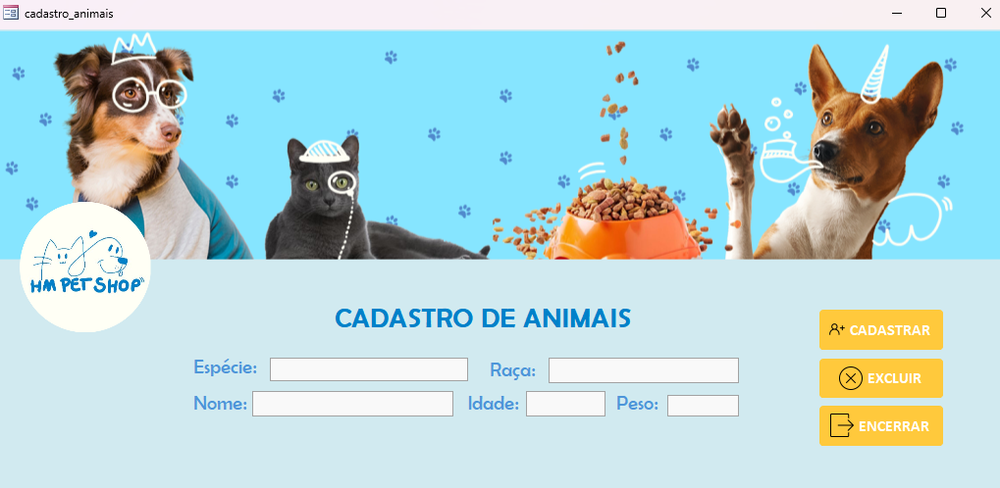

## 🦴Sobre o projeto:
O HM Petshop é um trabalho universitário da disciplina de Programação em Microinformática, no qual desenvolvemos no Access um sistema para um petshop fictício. Nosso sistema permite o usuário marcar consultas, banhos, tosas, comprar produtos para seu pet, entre outras funcionalidades.

## Telas

## 🎧Tecnologias:
- VBA
- Access

## Colaboradores:
- Mariana Ferreti
